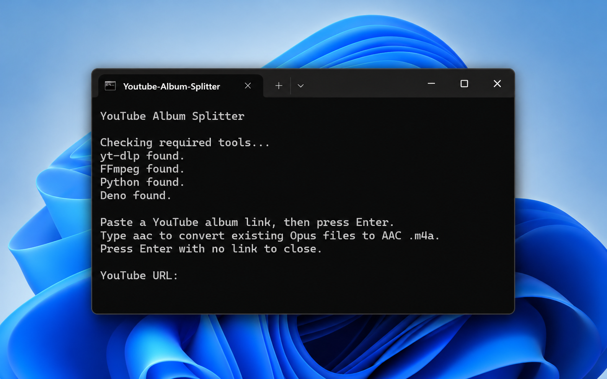
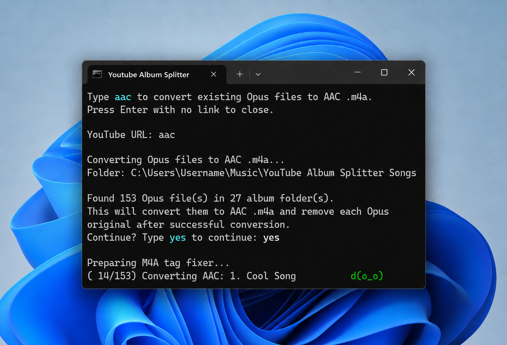

# YouTube Album Splitter

Self-contained Windows app. One `.bat` file. Double-click. Paste a YouTube link. Get separate song files.



YouTube Album Splitter is a self-contained Windows app packaged as a single `.bat` file. It turns a timestamped YouTube album upload you own or have permission to use into separate song files automatically, with no manual setup.

The tedious part was never just downloading audio. It was everything after that: splitting one long upload into tracks, naming the files cleanly, embedding album art, setting track numbers, fixing artist and album metadata, avoiding playlist surprises, and producing an output folder that is ready to drop into a music app.

This tool automates that full path while keeping the user flow deliberately simple:

```text
Download one BAT
Double-click
Paste one link
Get split and tagged songs
```

The released `.bat` checks dependencies, repairs missing tools when it can, downloads the audio, splits it into tracks, embeds album art, fixes metadata, cleans up temporary files, and lets you process another upload without restarting. Any helper scripts it needs are created temporarily by the tool itself.

It saves files like:

```text
1. Song Name.opus
2. Song Name.opus
3. Song Name.opus
```

It is designed for album-style YouTube uploads that have track timestamps. It uses YouTube chapter markers first. If YouTube does not expose chapter markers, it falls back to timestamp lines from the video description. If neither source gives usable track times, the tool keeps the full audio file instead of leaving an empty folder.

## How To Use

1. Go to the [latest release](../../releases/latest).
2. Download `YouTube Album Splitter.bat`.
3. Double-click it.
4. Paste the YouTube video link when it asks.
5. Press Enter.
6. Paste another link to process another upload, type `aac` to convert existing Opus files to AAC `.m4a`, or press Enter with no link to close.

After a run finishes, songs are saved into a `YouTube Album Splitter Songs` folder next to the `.bat` file. Each pasted link gets its own album subfolder, so uploads do not mix together.

## Features

* Single Windows app packaged as one `.bat` file.
* No separate installer, setup script, app folder, or helper-file bundle.
* Self-contained first-run setup: the `.bat` checks the tools it needs, uses `winget` when available, and has fallback paths for locked-down machines.
* Prompts for a YouTube link instead of making users edit commands.
* Lets you process multiple links in one session.
* Lets you type `aac` from the same prompt to convert existing Opus files in the output folder to AAC `.m4a` for apps/devices that need AAC.
* Rejects obvious non-YouTube links immediately instead of wasting time updating tools.
* Accepts normal YouTube, mobile YouTube, YouTube Music, and `youtu.be` links.
* Treats each pasted link as one selected video, even if the URL includes a playlist.
* Prefers YouTube's best available Opus audio.
* Splits the video into separate song files using YouTube chapter markers or description timestamps.
* Shows live terminal progress while downloading, splitting, tagging, and converting.
* Displays a download progress bar and real `current/total` counts while splitting and converting.
* Uses small terminal animations so long steps do not look frozen: a blinking status face while work is preparing, an animated download character once the progress bar appears, an AAC conversion animation, and a table-flip flourish when a run completes.
* Adds color to make the terminal easier to scan: color-coded status faces, a light-blue highlight on the `aac` and `yes` commands, and green checkmarks as each step finishes, with a plain-text fallback for terminals without color.
* Creates numbered filenames like `1. Song Name.opus`.
* Creates an album folder from the YouTube title when it can, like `Artist - Album`.
* Removes common extra title text like `(Instrumental)`, `(Instrumental Only)`, `Full Album`, `Full EP`, years, and bracket tags from the folder/album name when possible.
* Falls back to a generic folder/name when the YouTube title cannot be parsed.
* Embeds album art into every split song file.
* Crops album art to a centered 1:1 square so there are no black bars.
* Sets each title tag to the proper song name, like `Song Name`.
* Sets album and artist metadata when the YouTube title follows a clear `Artist - Album` style.
* Sets each track number tag to the correct number, like `1`.
* Removes genre metadata so files are not mislabeled.
* Deletes temporary files after the final tracks are finished.
* Keeps the full audio file only if no usable chapter markers or description timestamps are found, so the output folder is never empty.

## Timestamp Splitting

The split behavior follows a strict order:

1. YouTube chapter markers from the video.
2. Timestamp lines in the video description.
3. Full audio fallback if no usable track times are found.

Before downloading, the tool reads the video metadata and counts the usable tracks. It then downloads the full audio once and performs the actual track splitting with FFmpeg. That keeps the output order predictable while letting the terminal show real track counts during the split.

Description timestamps can look like:

```text
0:00 Song Name
3:15 - Song Name
[6:43] Song Name
01 - Song Name (13:52)
Song Name [17:34]
```

For description fallback, the tool requires at least two timestamps, the first timestamp must be `0:00`, and times must increase in order. This keeps the fallback useful for normal album descriptions without guessing track breaks.

## Automatic Setup

On first run, the script checks for yt-dlp, FFmpeg, Python, and the Python tagging library it needs. It installs missing tools automatically when possible, then refreshes PATH inside the current terminal session so the run can continue.

Deno is installed only if a download appears to need YouTube’s JavaScript challenge solver. It is skipped on normal runs.

The exact package IDs, network destinations, file locations, and uninstall commands are listed later in [Security, Privacy, and System Changes](#security-privacy-and-system-changes), so this section stays focused on what the first run does.

## Why It Is One File

The single-file release is the product design.

The released `.bat` carries the package manager logic, terminal UI, media pipeline, metadata pipeline, retry engine, and dependency resolver inside one inspectable file. That gives users an app-like workflow while keeping the normal path simple:

```text
Download one file
Double-click
Paste link
Get song files
```

A multi-file project layout would be easier internally, but worse for the intended user flow. Normal users should not have to install a Python project, keep several helper scripts together, configure a shell, copy commands, or understand the media stack just to split one timestamped album upload.

The complexity stays inside the automation. The release stays one file.

## How It Works

Internally, the tool is organized in layers even though the release is one `.bat` file:

```text
BAT launcher
-> embedded PowerShell controller
-> temporary Python tag fixer
-> yt-dlp / FFmpeg / mutagen / Deno backend
```

What each part does:

* **BAT**: Windows double-click entrypoint. Starts everything without requiring the user to open a terminal manually.
* **PowerShell**: Main controller. Handles prompts, dependency checks, automatic installs, PATH refresh, URL validation, yt-dlp calls, folder cleanup, retry/update behavior, and the loop for another link.
* **yt-dlp**: Reads video metadata, downloads the selected YouTube audio, and embeds the initial thumbnail/metadata.
* **FFmpeg**: Media backend for audio extraction, controlled track splitting, square cover cropping, and stream processing.
* **Python**: Runs only after Python exists. It is used for final metadata cleanup.
* **mutagen**: Python metadata library used to edit Opus/Ogg tags and embed cover art correctly.
* **Deno**: JavaScript runtime used by yt-dlp for modern YouTube extraction support when needed.
* **winget**: Windows package installer used to install missing helper tools automatically.

yt-dlp handles the initial metadata read, thumbnail handling, and full-audio download. The download is shown as a percentage progress bar. After that, the tool splits known tracks with FFmpeg so the terminal can show real `current/total` progress instead of pretending the split is one opaque operation.

Status animations are only terminal UI. The actual progress counts come from detected tracks and active download/conversion steps.

After splitting, the tool re-applies the final square cover art during metadata cleanup so Opus music players read the embedded art reliably.

The same internal pieces handle the optional AAC path. If you type `aac` at the prompt, the tool first shows how many Opus files and album folders it found, then asks you to type `yes` before converting. FFmpeg creates 192 kbps `.m4a` files and strips leftover chapter/data streams so each AAC file behaves like a normal single song. Mutagen then writes M4A-native tags and copies the embedded Opus cover art into M4A-native square album art. The original Opus files are removed only after their AAC replacements are created and tagged successfully.

## Reliability Features

YouTube changes often, so the script includes a recovery path.

If the first download attempt fails, it automatically updates the main download tools and retries once:

* yt-dlp
* FFmpeg
* Deno

If the active `yt-dlp` appears to be a Python-installed version, it also repairs that setup with the correct optional extras.

If yt-dlp is too old to understand one of the required options, the tool treats that as an outdated-tool problem and runs the same update/retry path.

This update step exists because outdated download tools are one of the most common reasons YouTube downloads suddenly stop working. The tool skips that path when the pasted text is obviously not a YouTube link, because there is nothing to repair. It also skips pointless updates when YouTube asks this machine for sign-in or extra verification.

Private videos, age restrictions, region locks, bot checks, sign-in requirements, and internet failures are handled as readable failures instead of silent exits.

If the retry still fails, the tool shows a plain-language message with common causes, such as:

* Private, deleted, age-restricted, or region-locked video.
* YouTube asking this machine for sign-in or extra verification.
* Playlist or channel link without a specific video selected.
* Blocked or unstable internet connection.
* A new YouTube change that needs a future yt-dlp update.

## Output Details

Each successful song file is cleaned up like this:

```text
Folder:        YouTube Album Splitter Songs\Artist - Album
Filename:      1. Song Name.opus
Title tag:     Song Name
Artist tag:    Artist
Album tag:     Album
Track number:  1
Album art:     Embedded
Genre:         Removed
```

The folder stays clean after a successful split:

```text
YouTube Album Splitter Songs
└─ Artist - Album
   ├─ 1. Song Name.opus
   ├─ 2. Song Name.opus
   └─ 3. Song Name.opus
```

Artist and album naming is based on the YouTube title. It works best when titles look like:

```text
Artist - Album
Artist - Album (Instrumental Only) - Full EP 2024
```

The dash can be a normal hyphen, en dash, or em dash. The tool can also clean up common extra upload text like:

```text
Artist - Album (Instrumental) - Full Album 2024
Artist - Album (Instrumental Only) - Full EP 2024
```

For example, this title:

```text
Example Artist - Example Album (Instrumental) - Full Album 2024
```

becomes:

```text
Artist: Example Artist
Album:  Example Album
Folder: Example Artist - Example Album
```

If the title cannot be parsed, the tool still downloads and tags the songs, but the album folder/name may be more generic. If title cleanup would produce an empty name, it falls back to the original video title.

If the folder name already exists, the tool adds a date/time suffix so a second run does not overwrite the first one.

Album art is forced to a square thumbnail. If the original thumbnail is already square, the crop does not change it. If it is wide or tall, the tool crops the center so the final cover art is 1:1.

The optional AAC conversion follows the same folder layout. It creates `.m4a` files next to the `.opus` files, replaces any matching `.m4a` from an earlier run, removes each Opus file after its AAC version is created successfully, and leaves the Opus file alone if conversion fails.

## Why It Uses Opus

YouTube's best audio is often already Opus. The tool prefers that stream because keeping source Opus as Opus avoids unnecessary re-encoding and keeps file sizes small.

If a video does not expose an Opus stream, yt-dlp may fall back to the best available audio and convert it to Opus so the rest of the split/tag pipeline stays consistent.

## Optional AAC Conversion

AAC conversion is built into the same app. Type `aac` at the prompt and it batch-converts the finished Opus library into tagged `.m4a` files.



The AAC converter scans the `YouTube Album Splitter Songs` folder for `.opus` files and turns them into `.m4a` AAC files. This is a real audio conversion, so it can take longer than the normal download/split step.

During conversion, the tool:

* creates an audio-only `.m4a` file,
* strips leftover chapter/data streams so the file behaves like one normal song,
* reads the embedded square Opus cover art directly,
* writes M4A-native title, artist, album, album artist, track number, and cover art tags,
* safely replaces any matching `.m4a` from an earlier run,
* deletes the original `.opus` only after the matching `.m4a` is created and tagged successfully,
* cleans up leftover temporary AAC work files from interrupted or older conversion runs.

If conversion fails for a file, the original `.opus` file is kept.

## Requirements

Windows is required.

On Windows 10 and Windows 11 systems, the script can set up its helper tools automatically with winget.

If winget is unavailable, the script can still set up most helper tools through Python. If Python is also missing, it prints manual Python install instructions and continues automated setup on the next run.

## Important

This works best with YouTube videos that have either chapter markers on the progress bar or clear timestamp lines in the description. If neither is available, the tool keeps the full audio file instead of leaving an empty folder.

Use this only for content you own, created, or have permission to download and process.

Windows may show a SmartScreen or antivirus warning because this is an unsigned helper script that installs/uses download tools. That warning is expected for small unsigned projects. If you trust the file, click **More info** then **Run anyway**.

## Design Choices

This project intentionally prioritizes a one-file, double-click Windows workflow over cross-platform command-line packaging.

* **Windows only**: the goal is a familiar Windows download-and-run experience without asking users to install a language runtime, configure a shell, or manage command-line flags.
* **One BAT release**: helper code is embedded so normal users do not have to keep multiple files together.
* **Explicit track times only**: the tool uses YouTube chapters first, then description timestamps. It does not guess tracks from silence by default because false splits are worse than keeping the full audio.
* **Automatic helper setup**: first run may install required tools through `winget` and `pip` so users do not have to set them up manually.
* **Opus first**: Opus is usually the best match for YouTube audio. AAC conversion is optional and lossy, intended for apps or devices that need `.m4a`.
* **No browser-cookie flow by default**: browser cookies are sensitive and exporting them is friction-heavy for normal users. Videos that require sign-in, cookies, or bot verification may fail; the lowest-friction path is to try again later, try another network/browser session, or use a video that does not require verification.

The release script is deliberately defensive: it is a recursive, polyglot bootstrapper and media pipeline packed into one inspectable Windows entrypoint. It resolves and repairs dependencies, refreshes the current-session tool path, handles multiple installer and fallback paths, normalizes YouTube inputs, isolates the selected video from playlist side effects, validates timestamp sources, retries recoverable tool failures, preserves originals during conversion, cleans temporary artifacts, and treats edge cases as readable failure modes instead of silent exits. The result is a one-file user flow backed by dependency resolution, state repair, metadata handling, conversion safety, and media-processing logic normally spread across several separate scripts.

## Private CI Validation Harness

Before public tagging, releases are checked with a private CI validation harness. It validates static integrity, dependency-path behavior, timestamp parsing, metadata handling, mock and fixture end-to-end runs, cleanup safety, conversion safety, retry behavior, rollback behavior, and known failure paths.

The harness exists so the public release can stay simple: one downloadable Windows script, with the fragile setup, parsing, tagging, conversion, cleanup, and failure paths tested before release.

## Security, Privacy, and System Changes

This project is open source, and the release download is the same plain-text `.bat` script from this repo. The release exists to make downloading easier for beginners.

Because the script can install helper tools automatically, here is exactly what it may change.

### Packages It May Install

Installed through `winget` when it is available and a tool is missing:

```text
yt-dlp.yt-dlp
Gyan.FFmpeg
Python.Python.3.12
DenoLand.Deno
```

Installed through `pip`:

```text
mutagen
yt-dlp[default]
curl-cffi
ffmpeg-downloader
```

`mutagen` is used for metadata handling.

`yt-dlp[default]` and `curl-cffi` are used on the retry/repair path when the active `yt-dlp` appears to be a Python-installed version.

`ffmpeg-downloader` is used only when `winget` is unavailable and the script needs a Python-based FFmpeg setup path.

Deno is installed only on demand, either through `winget` or its official installer, the first time a download needs YouTube's JavaScript challenge solver.

### Network Access

The script may contact:

* YouTube / YouTube Music, through `yt-dlp`, to read video data and download audio.
* GitHub, when `yt-dlp` downloads its external JavaScript challenge-solving component.
* Microsoft `winget` package sources, when installing or upgrading dependencies.
* Python package indexes, when installing `mutagen`, repairing a Python-installed `yt-dlp`, or setting up yt-dlp and FFmpeg without `winget`.
* `deno.land`, only when Deno is set up on demand without `winget`.

The script does not upload your files anywhere. It downloads audio from the link you provide and writes the finished files locally.

### Where Files Are Written

Finished songs are written next to the `.bat` file:

```text
<folder containing the .bat>\YouTube Album Splitter Songs
```

Each album/upload gets its own subfolder:

```text
<folder containing the .bat>\YouTube Album Splitter Songs\<album folder>
```

Temporary tag helpers:

```text
%TEMP%\fix_opus_chapter_tags.<random>.py
%TEMP%\fix_m4a_tags.<random>.py
```

During processing, a temporary `cover.jpg` may be created inside the album folder. It is removed after album art is embedded.

### PATH Behavior

The script refreshes `PATH` only inside its own running PowerShell window so newly installed tools can be found immediately. It may also add the standard Windows app execution alias folder to that in-window `PATH` so it can reliably find `winget`.

It does not directly edit your permanent system or user `PATH`. Tools installed through `winget` may add themselves to PATH through their normal installers.

### How To Inspect Before Running

The `.bat` file is plain text.

To inspect it before running:

1. Right-click `YouTube Album Splitter.bat`.
2. Click **Show more options** if needed.
3. Click **Edit**, or open it with Notepad / VS Code.

The first few lines launch PowerShell. The main script is embedded later in the same file after the `POWERSHELL_PAYLOAD` marker.

### How To Uninstall Helper Tools

Only uninstall these if you installed them for this tool and do not use them for anything else.

```powershell
winget uninstall --id yt-dlp.yt-dlp
winget uninstall --id Gyan.FFmpeg
winget uninstall --id Python.Python.3.12
winget uninstall --id DenoLand.Deno
```

Python packages:

Use whichever Python command works on your system. For example:

```powershell
python -m pip uninstall mutagen
python -m pip uninstall yt-dlp curl-cffi
python -m pip uninstall ffmpeg-downloader
```

Or, if your system uses the Python launcher:

```powershell
py -3 -m pip uninstall mutagen
py -3 -m pip uninstall yt-dlp curl-cffi
py -3 -m pip uninstall ffmpeg-downloader
```

If Deno was set up without `winget`, it lives in `%USERPROFILE%\.deno`; remove that folder to uninstall it.

If FFmpeg was set up with `ffmpeg-downloader`, run this before uninstalling the package to delete its downloaded binaries:

```powershell
ffdl remove --all
```

## License

This project is licensed under the GNU General Public License v3.0.

That means people can use, share, and modify it, but if they distribute modified versions, they must keep the same license and share the source code too.
